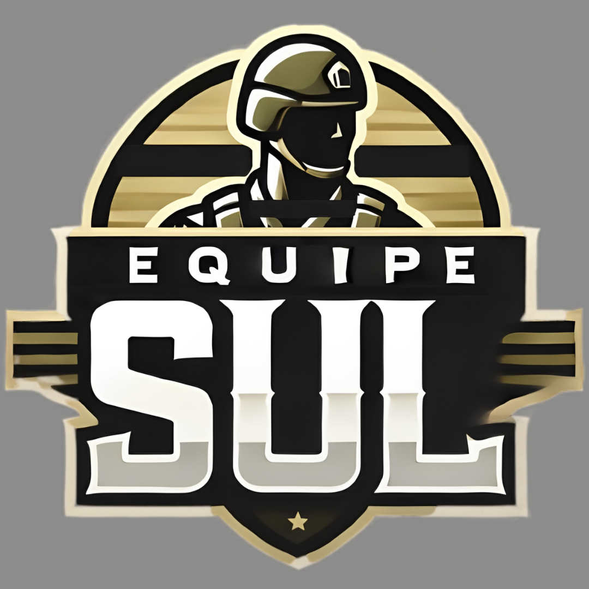

# ESUL - API ADS 5º Semestre
# [Nome do Projeto]

<p align="center">
      
      <h2 align="center">Equipe SUL</h2>
</p>

<p align="center">
  | <a href ="#desafio"> Desafio</a>  |
  <a href ="#solucao"> Solução</a>  |   
  <a href ="#backlog"> Backlog do Produto</a>  |
  <a href ="#dor">DoR</a>  |
  <a href ="#dod">DoD</a>  |
  <a href ="#sprint"> Cronograma de Sprints</a>  |
  <a href ="#tecnologias">Tecnologias</a> |
  <a href ="#manual">Manual de Instalação</a>  | 
  <a href ="#equipe"> Equipe</a> |
</p>

> Status do Projeto: Em Desenvolvimento 🛠
>
> Video do Projeto: Em Desenvolvimento 📽️

## 🏅 Desafio <a id="desafio"></a>
[Descrição do problema proposto pelo cliente.]

## 🏅 Solução <a id="solucao"></a>
[Explição da solução desenvolvida e como ela resolve o problema.]

## 💻 Tecnologias <a id="tecnologias"></a>
<h4 align="center">
 
 
</h4>

---

## 📋 Backlog do Produto <a id="backlog"></a>

| Rank | Prioridade | User Story | Story Points | Sprint | Requisito | Status |
| :--: | :--------: | :--------- | :----------: | :----: | :-------: | :----: |
| 1 | Alta | Template... | 0 | 1 | R01 | ✅ |
| 2 | Média | Lorem ipsum dolor sit amet... | 0 | 2 | R02 | 🏗️ |

---

## 🏃‍ DoR - Definition of Ready <a id="dor"></a>
- **Descrição clara:** A user story está escrita de forma compreensível.
- **Critérios de aceitação definidos:** Cada US tem critérios testáveis (como você já fez).
- **Dependências identificadas:** Não existem bloqueios externos (tecnologia, banco de dados, etc.) sem solução.
- **Estimativa feita:** Pontos de esforço foram atribuídos
- **Prioridade definida:** O valor de negócio está claro para a equipe.
- **Material de referência disponível:** Qualquer documento extra necessário (ex.: PDF com explicação do fluxo de leads e dimensões) está disponível.

## 🏆 DoD - Definition of Done <a id="dod"></a>
- Funcionalidade implementada
- Critérios de aceitação atendidos
- Testes unitários executados e aprovados
- Integração ao projeto por meio de pull request
- Validação do PO ou Scrum Master
- Atualização da documentação 

---

## 📅 Cronograma de Sprints <a id="sprint"></a>

| Sprint | Período | Documentação |
| :--- | :-----------: | :--- |
| 🔖 **SPRINT 1** | 07/09 - 27/09 | [Sprint 1 Docs](./link) |
| 🔖 **SPRINT 2** | 05/10 - 25/10 | [Sprint 2 Docs](./link) |
| 🔖 **SPRINT 3** | 02/11 - 22/11 | [Sprint 3 Docs](./link) |


---

## 📖 Manual de Instalação <a id="manual"></a>
### 🛠 Pré-requisitos
* Git, Node.js, Python...

### 1. Instalação
```bash
procedimento de clonagem, instalação e etc...
```

## 🎓 Equipe <a id="equipe"></a>

| Função         | Nome             | GitHub | LinkedIn |
| :-------------- | :---------------- | :------ | :-------- |
| Product Owner    | João Álvaro      | [](https://github.com/JoaoAlv4ro) | [](https://www.linkedin.com/in/joaoalv4ro) |
| Scrum Master | Raul Germano  | [](https://github.com/Raul-Germano-Rosendo) | [](https://www.linkedin.com/in/raul-germano-rod/) |
| Desenvolvedor  | Celso Moreira    | [](https://github.com/yCels) | [](https://www.linkedin.com/in/celso-moreira-freitas-957832222) |
| Desenvolvedor  | Leo Naito        | [](https://github.com/LNaito) |  | 
| Desenvolvedor  | Rafael   | [](https://github.com/rafa2-bit) | [](https://www.linkedin.com/in/rafael-candido-155705317) |
| Desenvolvedor  | Uanderson Leonardo | [](https://github.com/uandleon) | [](https://www.linkedin.com/in/uanderson-leonardo-1aaa722a0/) |
| Desenvolvedor  | Vivian Santos    | [](https://github.com/vivianSantos0101) | [](https://www.linkedin.com/in/vivianstoliveira) |
| Desenvolvedor  | Wesley Xavier    | [](https://github.com/xvierdev) | [](https://www.linkedin.com/in/xvierbr) |
